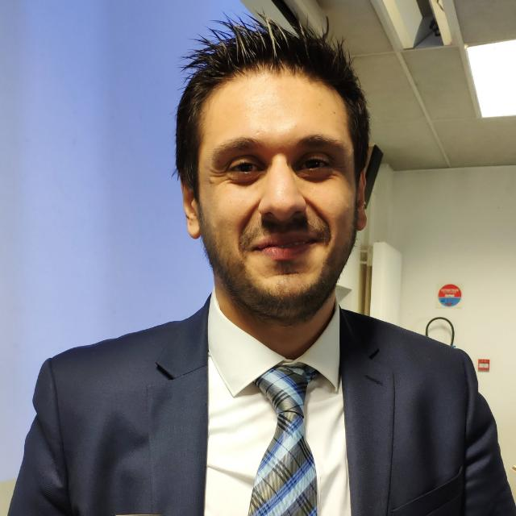
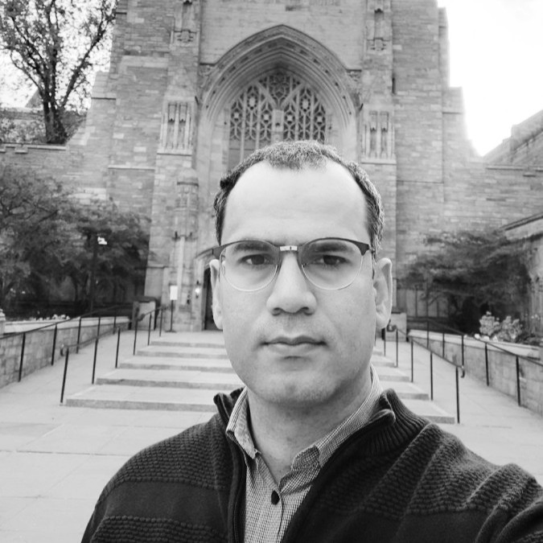

## LPSS -- Low Power and Secure Silicon

    
 

[Yehya NASSER](https://www.linkedin.com/in/yehya-nasser-phd/), Associate Professor, IMT Atlantique, France. Hardware Security & Embedded AI.

### Welcome Messsage: 

### Team Members

|  <!-- --> |  <!-- --> |
|:---------:|:---------:|
|  | |
| [**Mohamed Nassar**](https://www.linkedin.com/in/nassar1/) is assistant professor at the University *of* New Haven. His research interests are cybersecurity and machine learning. | [**Amer Baghdadi**](https://www.linkedin.com/in/)  |

### Recent Program Committee

### Recent Publications 

